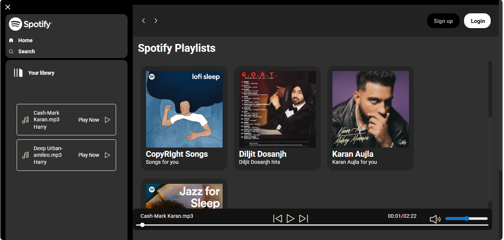
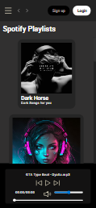
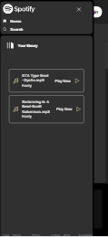

# MUSIC-PLAYER-SpotifyClone

# 🎵 Spotify Clone

A visually appealing and interactive **Spotify Clone** built using **HTML, CSS, and JavaScript**. This project mimics the core interface and functionality of the popular music streaming platform—Spotify. It features a dynamic song list ,albums , custom player controls, and responsive layout.

---

## 🚀 Features

✅ **Browse Songs**  
- Automatically fetches and lists all `.mp3` songs from a local `/songs` folder from the respective album.  
- Dynamically displays song titles , author name and thumbnails.

✅ **Play Music**  
- Click on any song to play it instantly.  
- Audio is streamed using the built-in JavaScript `Audio()` object.
- Seek option available
-Mute and Audio range changes 

✅ **Responsive UI**  
- Built with mobile-first design using pure HTML & CSS (no frameworks).  
- Music player layout adjusts across devices.

✅ **Functional Player Controls**  
- Displays current playing song.  
- Play and auto-play first song.  
- Support for future pause, next/prev buttons to play next or previous songs in the playlist.

✅ **Custom Song List UI**  
- Each song shows title and artist.  
- Play icon to start the song.

---

## 🛠️ Tech Stack

- **HTML** – Page structure and layout  
- **CSS** – Styling and responsive design  
- **JavaScript** – Functionality (fetching, playing, DOM manipulation)

---

## 📂 Project Structure
Spotify-Clone/ 
├── index.html 
├── utility.css 
├── style.css 
├── script.js 
├── /img/ 
│ └── music.svg, play.svg, pause.svg, etc. 
├── /songs/ 
│ └── Albums 
        └── your-song-files.mp3 

## 🚀 UI 

